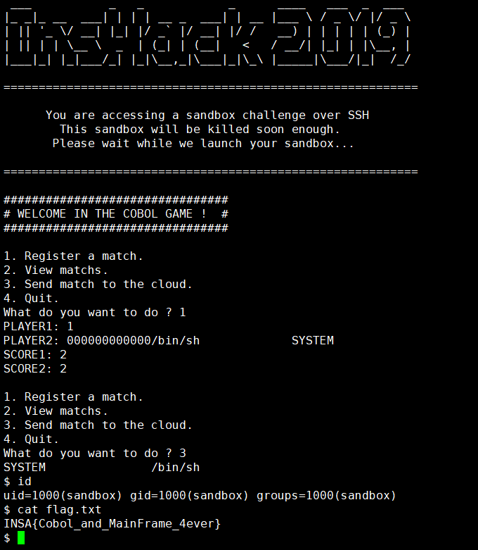

# OverCobol

I recently discover this file called `Test.CBL`. It seems to be a small service aiming at storing the result of babyfoot matchs between interns at the INSHACK BANK. Maybe you can break into the MAINFRAME.

You can found the [source code here](https://static.ctf.insecurity-insa.fr/a646237a9e68c8f1e1016d9e6376c2cc49745288.tar.gz) and you can connect to the MAINFRAME here: `ssh -i <your_keyfile> -p 2224 user@overcobol.ctf.insecurity-insa.fr`
To find your keyfile, look into your profile on this website.

---

## Background

### 1. division

- IDENTIFICATION DIVISION : 전체 프로그램에 대한 설명
- ENVIRONMENT DIVISION : 컴퓨터 시스템에 대한 환경정보
- DATA DIVISION : 프로그램 작동 상 필요한 변수 선언
- PROCEDURE DIVISION : 실제 코드 부분

### 2. 변수 선언

코볼의 변수 선언 방식 중 PIC라는 것이 있다. 선언 방식은 다음과 같다.

```cobol
LEVEL data-name PIC MODE
```

C와 비교하자면 data-name은 변수명, MODE는 자료형과 사이즈를 정의하는 부분이다. LEVEL은 코볼의 특수한 개념으로, 변수의 위치, 계층을 표현하기 위한 숫자이다.


PIC모드에는 여러가지가 있으나, 문제에 쓰인  `X`,`9`은 다음을 나타낸다.

- 9 : 숫자 데이터를 저장하는 모드
- X : 영문자 데이터를 저장하는 모드


또한, 변수는 독립적으로 존재할 수도, 그룹에 종속될 수도 있는데, 그룹의 선언 방식은 변수 선언과 유사하다.  LEVEL과 data-name만 표기한다. 그룹은 C의 구조체와 비슷하다고 보면 될 것 같다.


다음과 같은 정의 예시가 있다.

```cobol
01 CLASS.
      02 NAME PIC X(10).
      02 NUM PIC 99.
```

이는 다음을 의미한다.

👉 CLASS라는 계층안에, <u>영문자 10자</u>까지를 저장할 수 있는 NAME이란 변수가 있으며, <u>2자리 정수</u>를 저장할 수 있는 NUM이란 변수가 있다.


:pencil:ACCEPT를 통한 변수 입력 과정에서 오버플로우 가능성?

기본적으로는 없는 것같다. 만약 위와 같이 `X(10)`으로 변수를 선언할 경우, 10자 이상의 영문자가 들어올 경우 다음 메모리 영역을 침범하는 것이 아니라, 입력을 아예 무시한다. 


### 3. REDEFINES

이 문제의 취약점이 되는 개념이다. `REDEFINES`는 기존에 존재하는 변수를 다른 이름으로, 다른 자료형으로 공유하게 해주는 선언이다. C에서의 `union`과 비슷하다 할 수 있다. 문제를 통해 자세히 알아보자.

---

## Analyze

코드에서 핵심이 되는 부분은 <u>변수 선언</u>, <u>REGISTER MATCH</u>함수, <u>SEND-CLOUD</u>함수이다.

### 1. 변수 선언

```cobol
DATA DIVISION.
       WORKING-STORAGE SECTION.
         01 SUBPRG.
           02 TMPNAME PIC X(10).
           02 TMPSCORE PIC 99.
           02 SUBPRGARG PIC X(20).
           02 SUBPRGNAME PIC X(20).
         01 TMPNAME2 REDEFINES SUBPRG PIC X(40).
```

SUBPRG라는 그룹안에 변수 4개가 등록되어있다. 그 중 `SUBPRGARG`, `SUBPRGNAME`을 주의해서 보자. 그리고 `REDEFINES`선언을 통해 TMPNAME2라는 변수가 SUBPRG변수를 40바이트 크기의 문자 자료형으로 공유한다.


### 2.REGISTER MATCH함수

```cobol
REGISTER-MATCH.
         IF NBMATCH = 10
           DISPLAY "TOO MUCH MATCH."
           GO TO MENU-LAB
         END-IF

         DISPLAY "PLAYER1: " NO ADVANCING
         ACCEPT TMPNAME
         MOVE TMPNAME TO PLAYER1(NBMATCH + 1)

         DISPLAY "PLAYER2: " NO ADVANCING
         ACCEPT TMPNAME2
         MOVE TMPNAME TO PLAYER2(NBMATCH + 1)

         DISPLAY "SCORE1: " NO ADVANCING
         ACCEPT TMPSCORE
         MOVE TMPSCORE TO SCORE1(NBMATCH + 1)

         DISPLAY "SCORE2: " NO ADVANCING
         ACCEPT TMPSCORE
         MOVE TMPSCORE TO SCORE2(NBMATCH + 1)
         
         ADD 1 TO NBMATCH.

       END-REGISTER-MATCH.
         EXIT.
```

PLAYER2의 이름을 입력하는 부분을 보면, 이 부분만 `ACCEPT TMPNAME2`를 통해 `REDEFINE`된 변수에 입력을 받는 것을 알 수 있다. <u>TMPNAME2는 문자열 40바이트를 받기 때문에 SUBPRG의 SUBPRGNAME, SUBPRGARG변수를 모두 덮을 수 있다.</u>


### 3.SEND-CLOUD함수

```cobol
SEND-CLOUD.
         IF SUBPRGNAME = SPACE
           MOVE "send" TO SUBPRGNAME
           MOVE "matchs" TO SUBPRGARG
         END-IF
          DISPLAY SUBPRGNAME " " SUBPRGARG
          CALL SUBPRGNAME USING SUBPRGARG.
       END-SEND-CLOUD.
         EXIT.
```

`SUBPRGNAME`이 공백이 아닐 경우 `CALL SUBPRGNAME USING SUBPRGARG`를 통해 SUBPRGNAME(SUBPRGARG)으로 함수를 호출해준다.

---

## ATTACK

COBOL에는 `SYSTEM`이라는 함수가 존재하는데, 이 함수는 인자로 들어온 프로그램을 실행시켜준다. `C`의 `system`함수와 굉장히 유사하다. 이 함수를 통해 간단히 쉘을 획득할 수 있다.

`TMPNAME2`가 `SUBPRG`변수와 메모리를 공유하는 점을 이용하여 player2의 이름을 

'000000000000/bin/sh             SYSTEM'

와 같이 입력해주면 `SUBPRGNAME`에 SYSTEM, `SUBPRGARG`에 '/bin/sh'가 저장되고, SEND-CLOUD함수를 호출하면 SYSTEM('/bin/sh')가 호출되면서 쉘을 획득하게 된다.

